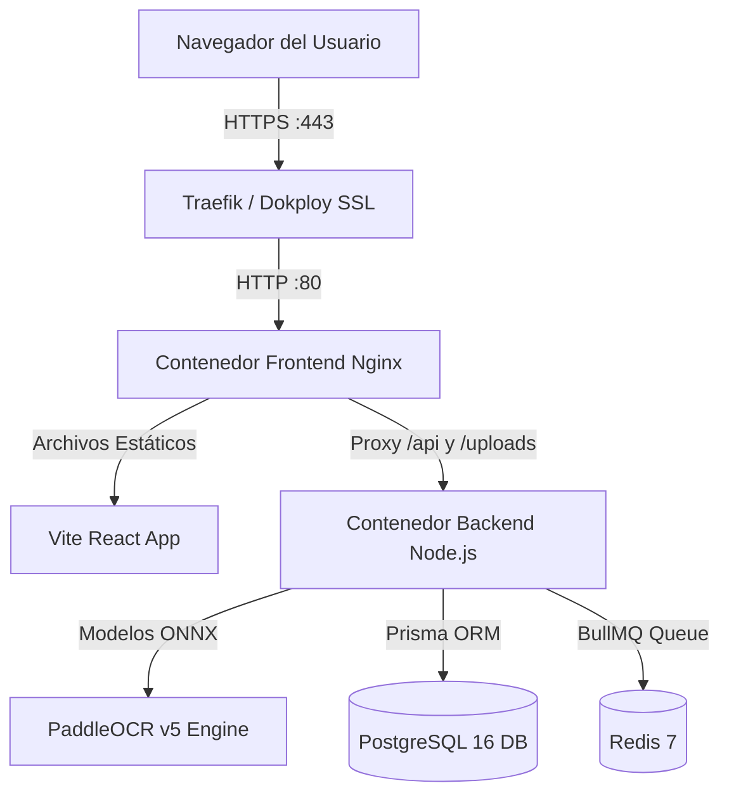

# 🚀 Guía de Despliegue en VPS con Dokploy
### Sistema de Extracción y Validación de Cédulas (SENA)

Esta guía te explica paso a paso cómo desplegar la aplicación completa (Frontend, Backend con PaddleOCR/ONNX, PostgreSQL y Redis) en tu servidor VPS utilizando **Dokploy**.

---

## 1. Arquitectura de Despliegue en Dokploy

El sistema está configurado mediante un archivo `docker-compose.yml` multi-contenedor que Dokploy administra de forma nativa:



---

## 2. Preparativos en tu VPS

1. **Accede a tu panel de Dokploy:**
   Normalmente se encuentra en `http://TU_IP_VPS:3000`.
2. **Asegúrate de que tu Dominio o Subdominio apunte a la IP de tu VPS:**
   - Crear un registro **A** en tu proveedor de DNS (Cloudflare, GoDaddy, Namecheap, etc.):
     - **Tipo:** `A`
     - **Nombre:** `ocr` (o el subdominio que elijas, ej: `@` para raíz)
     - **Contenido:** `IP_PUBLICA_DE_TU_VPS`
     - **Proxy:** Desactivado inicialmente (DNS only) para la emisión del certificado SSL de Let's Encrypt.

---

## 3. Despliegue en Dokploy (Paso a Paso)

### Paso 1: Crear el Proyecto y la Aplicación en Dokploy
1. En el menú lateral de Dokploy, entra en **Projects** y haz clic en **Create Project** (ej: `SENA-OCR`).
2. Dentro del proyecto, haz clic en **Create Service** y selecciona **Compose**.
3. Asígnale un nombre (ej: `sena-ocr-stack`).

---

### Paso 2: Conectar el Repositorio Git
1. En la pestaña **General** del servicio Compose:
   - **Source Type:** Selecciona **GitHub** (o Git Repository).
   - **Repository:** Selecciona el repositorio de este proyecto (`DF-VeraP/ocr`).
   - **Branch:** `main` (o la rama donde tengas el código).
   - **Compose Path:** `./docker-compose.yml`

---

### Paso 3: Configurar las Variables de Entorno
1. Dirígete a la pestaña **Environment** en Dokploy.
2. Copia y pega las siguientes variables (puedes basarte en `.env.production.example`):

```env
# URL de tu dominio público
CLIENT_URL=https://ocr.tudominio.com
PORT=80

# Base de Datos PostgreSQL
POSTGRES_USER=sena_admin
POSTGRES_PASSWORD=GeneraUnPasswordSeguro2026*
POSTGRES_DB=ocr_cedulas

# Seguridad JWT (genera cadenas largas aleatorias)
JWT_SECRET=sena_super_secret_jwt_access_token_key_2026_prod_secure
JWT_REFRESH_SECRET=sena_super_secret_jwt_refresh_token_key_2026_prod_secure
JWT_EXPIRES_IN=15m
JWT_REFRESH_EXPIRES_IN=7d

# Administrador inicial
ADMIN_EMAIL=admin@sena.edu.co

# Notificaciones por Correo (Gmail SMTP)
SMTP_HOST=smtp.gmail.com
SMTP_PORT=587
SMTP_USER=tu_correo@gmail.com
SMTP_PASS=tu_app_password_de_16_caracteres
```
3. Haz clic en **Save**.

---

### Paso 4: Configurar el Dominio y Certificado SSL
1. Ve a la pestaña **Domains** en Dokploy.
2. Haz clic en **Add Domain**:
   - **Host:** `ocr.tudominio.com` (tu subdominio o dominio)
   - **Service:** Selecciona el contenedor `frontend`
   - **Port:** `80`
   - **Certificate:** Marca **Let's Encrypt** (para HTTPS automático gratuito)
3. Haz clic en **Save**.

---

### Paso 5: Desplegar la Aplicación
1. En la esquina superior derecha, haz clic en el botón **Deploy**.
2. Dokploy ejecutará:
   - Descarga del código fuente desde Git.
   - Construcción de las imágenes Docker (Frontend con Vite/Nginx y Backend con PaddleOCR/ONNX).
   - Inicio automático de PostgreSQL 16 y Redis 7 con comprobación de estado de salud (`healthy`).
   - El script de entrada (`docker-entrypoint.sh`) ejecutará automáticamente:
     - Espera a que PostgreSQL esté listo.
     - `npx prisma migrate deploy` (aplica la estructura de tablas).
     - `npx ts-node prisma/seed.ts` (crea el usuario Administrador predeterminado).
     - Inicio de Node.js en producción.

---

## 4. Verificación y Primer Inicio de Sesión

1. Abre tu navegador e ingresa a: `https://ocr.tudominio.com`.
2. Verás la pantalla de inicio de sesión del sistema SENA OCR.
3. Inicia sesión con las credenciales maestras predeterminadas:
   - **Correo:** `admin@sena.edu.co`
   - **Contraseña inicial:** `Admin2026*`
4. ¡Listo! El sistema ya está en producción y listo para procesar lotes de cédulas con máxima velocidad.

---

## 5. Volúmenes Persistentes y Respaldos

Dokploy creará automáticamente los siguientes volúmenes con persistencia en el disco de tu VPS:

| Volumen | Ubicación / Contenedor | Propósito |
| :--- | :--- | :--- |
| `sena_ocr_postgres_data` | `/var/lib/postgresql/data` | Todas las tablas, lotes, documentos y usuarios. |
| `sena_ocr_redis_data` | `/data` | Estado de las colas de procesamiento BullMQ. |
| `sena_ocr_uploads_data` | `/app/uploads` | Recortes de fotos y cédulas procesadas. |

> [!TIP]
> **Actualizaciones futuras:**
> Cada vez que hagas `git push` a tu repositorio, puedes presionar **Deploy** en Dokploy o activar el **Webhook de despliegue automático**. La base de datos y los archivos no se borrarán gracias a los volúmenes persistentes.
