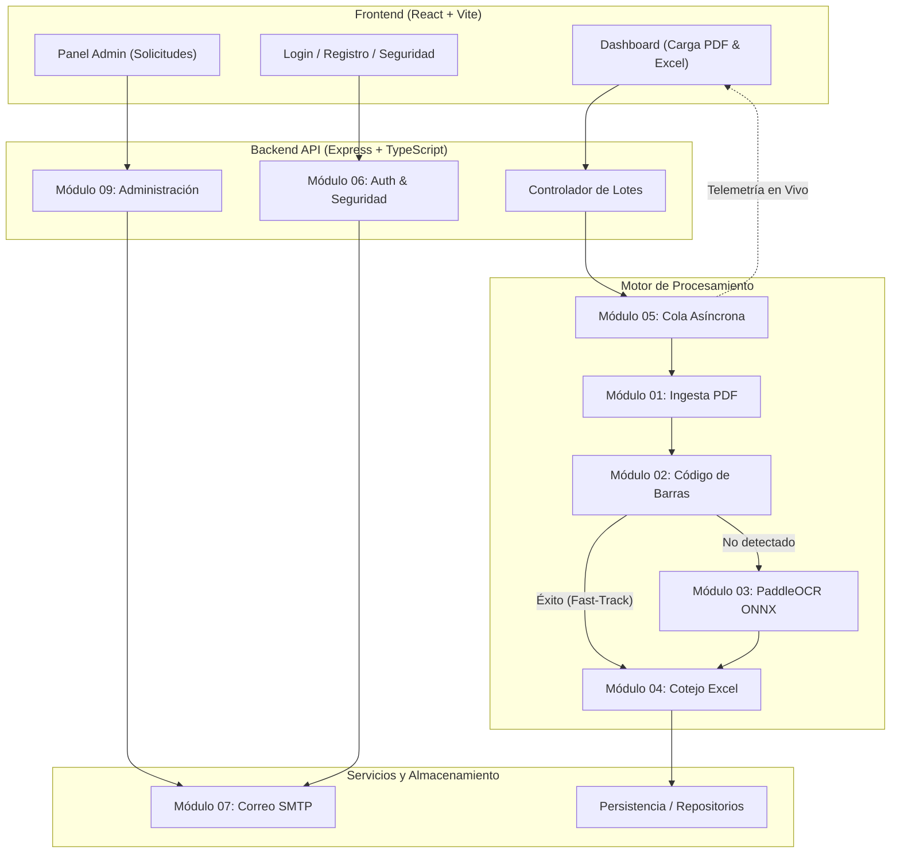

# 📚 Documentación Técnica del Sistema por Módulos
## SENA • Sistema de Extracción y Validación Automatizada de Cédulas

Bienvenido a la documentación técnica y arquitectónica del sistema de extracción y validación de documentos de identidad del SENA. Este compendio detalla exhaustivamente la arquitectura, funcionamiento, responsabilidades y componentes de cada módulo del sistema.

---

### 🗺️ Índice de Módulos del Sistema

| # | Módulo | Archivo .md | Descripción Resumida |
|---|--------|-------------|----------------------|
| **01** | **Ingesta y Procesamiento de PDF** | [`01_ingesta_pdf.md`](./modulos/01_ingesta_pdf.md) | Extracción de páginas, renderizado en alta resolución a imágenes (DPI optimizado), corrección de orientación y filtrado frente/reverso. |
| **02** | **Lectura de Códigos de Barras** | [`02_codigo_barras.md`](./modulos/02_codigo_barras.md) | Decodificación rápida de códigos PDF417 de la cédula colombiana (RNEC) vía ZXing. Extracción instantánea de NUIP, nombres, apellidos, sexo y RH. |
| **03** | **Reconocimiento Óptico (OCR)** | [`03_ocr_paddle_onnx.md`](./modulos/03_ocr_paddle_onnx.md) | Motor neuronal PaddleOCR v5 sobre ONNX Runtime con modelos precalentados en RAM, fallback a Tesseract y regex especializadas para cédulas colombianas. |
| **04** | **Cotejo y Validación con Excel** | [`04_validacion_cotejo_excel.md`](./modulos/04_validacion_cotejo_excel.md) | Parseo de planillas oficiales SENA (`.xls`/`.xlsx`), normalización fonética y cálculo de similitud Levenshtein/Jaro-Winkler. |
| **05** | **Cola y Procesamiento Asíncrono** | [`05_cola_procesamiento.md`](./modulos/05_cola_procesamiento.md) | Gestión de lotes en segundo plano (`QueueService`), emisión de eventos de telemetría en tiempo real y optimización de memoria. |
| **06** | **Autenticación y Seguridad** | [`06_autenticacion_seguridad.md`](./modulos/06_autenticacion_seguridad.md) | Control de acceso basado en roles (`ADMIN`/`INSTRUCTOR`), tokens JWT, bloqueo por fuerza bruta, inactividad y políticas de contraseña segura. |
| **07** | **Notificaciones y Correo SMTP** | [`07_notificaciones_correo.md`](./modulos/07_notificaciones_correo.md) | Envío de correos automáticos institucionales vía Nodemailer (aprobación de cuenta, contraseñas temporales, recuperación de acceso). |
| **08** | **Frontend y Experiencia de Usuario** | [`08_frontend_dashboard.md`](./modulos/08_frontend_dashboard.md) | Arquitectura React + Vite + TailwindCSS: Dashboard de validación, visor interactivo de discrepancias, soporte Dark/Light y cero scroll. |
| **09** | **Administración y Aprobación de Cuentas** | [`09_administracion_solicitudes.md`](./modulos/09_administracion_solicitudes.md) | Flujo administrativo de revisión de solicitudes de registro, creación de usuarios autorizados y revocación. |
| **10** | **Arquitectura y Despliegue** | [`10_despliegue_arquitectura.md`](./modulos/10_despliegue_arquitectura.md) | Configuración de Docker, Docker Compose, Nginx Reverse Proxy y despliegue en VPS mediante Dokploy. |

---

### 🧩 Diagrama de Interacción entre Módulos

---

Para profundizar en el funcionamiento interno de cualquiera de estos módulos, diríjase a la carpeta `docs/modulos/` o navegue mediante los enlaces de la tabla superior.
