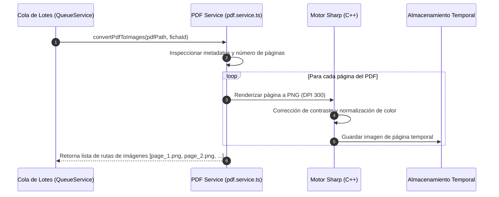

# 📄 Módulo 01: Ingesta y Procesamiento de Documentos PDF

## 1. Descripción General
El **Módulo de Ingesta y Procesamiento de PDF** es la puerta de entrada de los archivos documentales al sistema. Es responsable de recibir los expedientes en formato PDF con las cédulas de ciudadanía escaneadas de los aprendices de una ficha, analizar su estructura, desempaquetar cada página y convertirlas en imágenes de alta resolución optimizadas para la visión computacional y el reconocimiento de patrones.

---

## 2. Archivos y Componentes Clave
- **Servicio Principal**: [`backend/src/services/pdf.service.ts`](file:///c:/Users/Lenovo/Documents/SENA/OCR/backend/src/services/pdf.service.ts)
- **Librerías Utilizadas**:
  - `pdf-to-img` / `pdf2pic` / `poppler-utils`: Renderizado vectorial de páginas PDF a mapas de bits (PNG/JPEG).
  - `sharp`: Procesamiento de imágenes de alto rendimiento en C++ (binarización, redimensionamiento, contraste adaptativo y corrección de rotación EXIF).

---

## 3. Flujo de Trabajo y Procesamiento



---

## 4. Características Técnicas y Optimizaciones
1. **Resolución Óptima (DPI 300)**:
   - Se ajusta la densidad de píxeles a 300 DPI. Una resolución menor reduce la legibilidad de caracteres pequeños en las cédulas amarillas con hologramas, mientras que una mayor satura el consumo de memoria sin aportar mejoras de precisión.
2. **Filtrado y Agrupamiento Frente / Reverso**:
   - En fichas del SENA (por ejemplo, ficha 3591229), los documentos pueden presentarse en una sola página con el frente y reverso juntos, o en páginas consecutivas independientes. El servicio detecta la disposición y suministra las regiones de interés tanto para el anverso (datos biográficos legibles) como para el reverso (código de barras PDF417).
3. **Limpieza de Recursos (Garbage Collection)**:
   - Los archivos temporales generados durante el renderizado se almacenan en un directorio aislado con prefijo UUID/Ficha y se depuran automáticamente al culminar el procesamiento del lote o en caso de fallo crítico.

---

## 5. Parámetros de Entrada y Salida

### Entrada:
```typescript
interface ConvertPdfOptions {
  pdfPath: string;          // Ruta en disco del archivo PDF cargado
  fichaId: string;          // Identificador único de la ficha o lote
  dpi?: number;             // Resolución (por defecto: 300)
  outputFormat?: 'png' | 'jpeg'; // Formato de imagen
}
```

### Salida:
```typescript
interface PageExtractionResult {
  pageNumber: number;       // Número de página (1-indexado)
  imagePath: string;        // Ruta de la imagen renderizada en disco
  width: number;            // Ancho en píxeles
  height: number;           // Alto en píxeles
}
```
