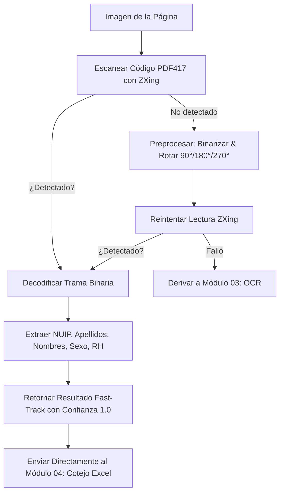

# 📊 Módulo 02: Lectura de Códigos de Barras (PDF417)

## 1. Descripción General
El **Módulo de Lectura de Códigos de Barras** es el componente de alta velocidad (**Fast-Track**) del sistema. Se encarga de localizar, decodificar y extraer la información biográfica contenida en el código de barras bidimensional **PDF417**, ubicado en el reverso de la cédula de ciudadanía colombiana expedida por la Registraduría Nacional del Estado Civil (RNEC).

Al procesar directamente el código de barras, el sistema obtiene los datos con un **100% de exactitud criptográfica**, eliminando cualquier error de reconocimiento tipográfico y reduciendo el tiempo de procesamiento por documento a milisegundos.

---

## 2. Archivos y Componentes Clave
- **Servicio Principal**: [`backend/src/services/barcode.service.ts`](file:///c:/Users/Lenovo/Documents/SENA/OCR/backend/src/services/barcode.service.ts)
- **Librerías Utilizadas**:
  - `@zxing/library`: Motor de decodificación de códigos de barras 1D/2D para Node.js y navegadores.
  - `sharp`: Preprocesamiento de recortes, binarización por umbral (Otsu/Adaptive Thresholding) y rotaciones para maximizar la tasa de lectura.

---

## 3. Estructura de la Trama de Datos de la Cédula Colombiana (RNEC)

La Registraduría almacena los datos en formato binario estructurado según el estándar de la entidad. El servicio parsea los campos de acuerdo con la especificación de offsets:

```
[Cabecera Binaria / Control]
  ↓
[NUIP / Número de Cédula] (10 caracteres)
  ↓
[Primer Apellido] (Hasta 26 caracteres)
  ↓
[Segundo Apellido] (Hasta 26 caracteres)
  ↓
[Primer Nombre] (Hasta 26 caracteres)
  ↓
[Segundo Nombre] (Hasta 26 caracteres)
  ↓
[Sexo] ('M' / 'F')
  ↓
[Fecha de Nacimiento] (AAAAMMDD)
  ↓
[Grupo Sanguíneo y Factor RH] ('O+', 'A-', 'B+', 'AB+', etc.)
```

---

## 4. Flujo de Decodificación y Fast-Track



---

## 5. Parámetros de Entrada y Salida

### Entrada:
```typescript
interface ScanBarcodeOptions {
  imageBuffer: Buffer;      // Buffer binario de la imagen
  tryRotations?: boolean;   // Intentar rotaciones automáticas si falla (0°, 90°, 180°, 270°)
}
```

### Salida:
```typescript
interface BarcodeScanResult {
  success: boolean;
  nuip?: string;            // Número Único de Identificación Personal (Cédula)
  primerApellido?: string;
  segundoApellido?: string;
  primerNombre?: string;
  segundoNombre?: string;
  nombreCompleto?: string;
  sexo?: 'M' | 'F';
  fechaNacimiento?: string; // YYYY-MM-DD
  rh?: string;              // Ejemplo: "O+"
  confidence: number;       // 1.0 en lectura exitosa
  extractionMethod: 'BARCODE_PDF417';
}
```

---

## 6. Manejo de Casos Especiales
- **PDFs con imágenes inclinadas o invertidas**: Si el usuario subió el escaneo al revés, el servicio rota la imagen en incrementos de 90° hasta conseguir una lectura válida.
- **Baja iluminación o sombras**: Se aplica un filtro de umbral adaptativo (`adaptiveThreshold`) para separar las barras negras del fondo blanco degradado.
