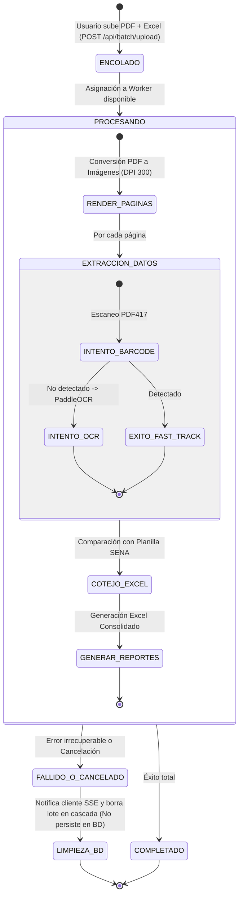

# ⚡ Módulo 05: Cola y Procesamiento Asíncrono de Lotes

## 1. Descripción General
El **Módulo de Cola y Procesamiento Asíncrono** administra el flujo de trabajo cuando se procesan fichas del SENA que contienen decenas o cientos de aprendices. Debido a que el análisis de PDFs de gran tamaño y la inferencia de redes neuronales son tareas intensivas en CPU y memoria, este módulo desacopla la recepción del archivo HTTP de su procesamiento, evitando bloqueos del servidor y caídas por saturación (`Out of Memory`).

---

## 2. Archivos y Componentes Clave
- **Servicio Principal**: [`backend/src/services/queue.service.ts`](file:///c:/Users/Lenovo/Documents/SENA/OCR/backend/src/services/queue.service.ts)
- **Controlador de Lotes**: [`backend/src/controllers/batch.controller.ts`](file:///c:/Users/Lenovo/Documents/SENA/OCR/backend/src/controllers/batch.controller.ts)
- **Patrón Arquitectónico**:
  - Cola basada en eventos (`EventEmitter` en memoria con soporte modular para Redis/BullMQ).
  - Concurrencia controlada (1 a 2 fichas en paralelo según núcleos de CPU disponibles).

---

## 3. Flujo de Estados del Lote



> **Política de Integridad en Base de Datos**: Si un lote falla o es cancelado por el usuario, el sistema notifica el evento vía Server-Sent Events (SSE) y procede inmediatamente a eliminar el lote y sus registros parciales de PostgreSQL mediante eliminación en cascada (`prisma.processingBatch.delete`), evitando la persistencia de datos inconsistentes o huérfanos.

---

## 4. Telemetría y Monitoreo de Progreso en Tiempo Real
El módulo expone telemetría granular que el Frontend consulta mediante sondeo o WebSockets:

```typescript
interface BatchProgressPayload {
  batchId: string;
  ficha: string;
  status: 'QUEUED' | 'PROCESSING' | 'COMPLETED' | 'FAILED';
  currentPage: number;
  totalPages: number;
  progressPercent: number;    // 0 a 100%
  processedCount: number;
  barcodeSuccessCount: number; // Métrica Fast-Track
  ocrSuccessCount: number;     // Métrica OCR
  discrepanciesCount: number;
  currentStepMessage: string; // Ej: "Analizando página 14 de 35 (Fast-Track Barcode)..."
}
```

---

## 5. Estrategias de Rendimiento y Gestión de Memoria
1. **Paginación en Streaming**: Las imágenes se procesan de forma secuencial o en micro-lotes; una vez extraída la información de una página, el buffer se libera de memoria.
2. **Precalentamiento de Redes Neuronales (Pre-warming)**: Las instancias de ONNX Runtime para PaddleOCR se inicializan una sola vez al arrancar el servidor backend, ahorrando el costo de inicialización de ~2.5 segundos por cada llamada.
3. **Cancelación Segura**: Si un usuario cancela el proceso o cierra la ventana, la cola interrumpe la ejecución del lote y limpia los archivos temporales asociados.
