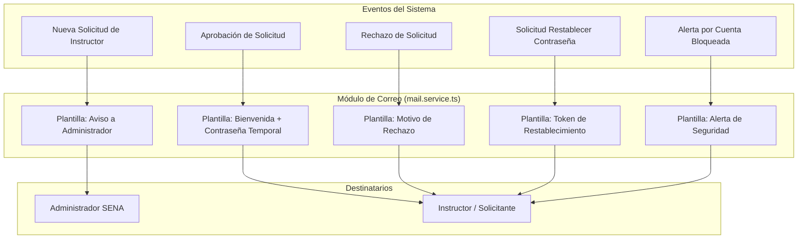

# 📧 Módulo 07: Notificaciones y Servicio de Correo SMTP

## 1. Descripción General
El **Módulo de Notificaciones y Correo SMTP** es el canal oficial de comunicación transaccional entre la plataforma SENA OCR y los usuarios (administradores e instructores). Se encarga de enviar correos electrónicos formateados con la identidad visual corporativa del SENA para eventos críticos del ciclo de vida de las cuentas.

---

## 2. Archivos y Componentes Clave
- **Servicio Principal**: [`backend/src/services/mail.service.ts`](file:///c:/Users/Lenovo/Documents/SENA/OCR/backend/src/services/mail.service.ts)
- **Librería Utilizada**:
  - `nodemailer`: Cliente de transporte SMTP para Node.js con soporte TLS/SSL y autenticación.
- **Configuración de Variables de Entorno**:
  - `SMTP_HOST`: Servidor de correo saliente (ej: `smtp.gmail.com` u `office365.com`).
  - `SMTP_PORT`: Puerto seguro (`587` con STARTTLS o `465` con SSL).
  - `SMTP_USER`: Cuenta de correo institucional o de servicio.
  - `SMTP_PASS`: Contraseña de aplicación generada.
  - `ADMIN_EMAIL`: Correo del administrador que recibe avisos de nuevas solicitudes.

---

## 3. Catálogo de Notificaciones Transaccionales

---

## 4. Estructura y Diseño de las Plantillas de Correo
Todas las notificaciones se emiten en formato HTML responsivo con soporte para clientes de correo modernos (Gmail, Outlook, Apple Mail):
- **Encabezado Institucional**: Logotipo del SENA y franja verde institucional (`#39A900`).
- **Cuerpo del Mensaje**: Instrucciones claras, detalles de la solicitud y botones de acción destacados (*Call-To-Action*).
- **Seguridad**: Los enlaces de restablecimiento de contraseña incorporan un token criptográfico de un solo uso con vigencia máxima de **30 minutos**.
- **Modo Fallback / Desarrollo**: Si no se configuran credenciales SMTP en el archivo `.env`, el servicio entra en modo simulación, registrando en los logs del servidor el enlace y contenido para permitir pruebas locales sin necesidad de servidor SMTP externo.
