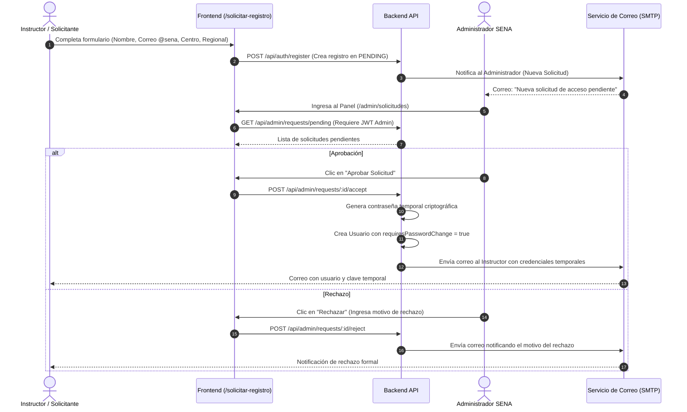

# 👥 Módulo 09: Administración y Gestión de Solicitudes

## 1. Descripción General
El **Módulo de Administración y Gestión de Solicitudes** implementa el flujo de control de acceso institucional gobernado por administradores. A diferencia de los sistemas abiertos donde cualquier persona puede crear una cuenta, en este sistema los instructores deben solicitar acceso formal indicando sus datos institucionales y centro de formación. El administrador revisa y aprueba o rechaza cada solicitud antes de que el usuario pueda ingresar.

---

## 2. Archivos y Componentes Clave
- **Controlador de Administración**: [`backend/src/controllers/admin.controller.ts`](file:///c:/Users/Lenovo/Documents/SENA/OCR/backend/src/controllers/admin.controller.ts)
- **Rutas Administrativas**: `backend/src/routes/admin.routes.ts`
- **Página Frontend**: [`frontend/src/pages/AdminRequests.tsx`](file:///c:/Users/Lenovo/Documents/SENA/OCR/frontend/src/pages/AdminRequests.tsx)
- **Modelos de Datos**:
  - `User`: Cuenta de usuario activa en el sistema.
  - `RegistrationRequest`: Solicitud con estados `PENDING`, `APPROVED` o `REJECTED`.

---

## 3. Flujo Completo de Registro y Aprobación



---

## 4. Endpoints de la API Administrativa

### 1. Listar Solicitudes Pendientes
- **Método y Ruta**: `GET /api/admin/requests/pending`
- **Seguridad**: Autenticación Bearer Token + Rol `ADMIN`.
- **Respuesta**:
  ```json
  [
    {
      "id": "req_88f912c4",
      "fullName": "Carlos Alberto Gómez",
      "email": "carlos.gomez@sena.edu.co",
      "documentNumber": "1098765432",
      "center": "Centro de Servicios Financieros",
      "regional": "Distrito Capital",
      "createdAt": "2026-09-13T18:00:00.000Z",
      "status": "PENDING"
    }
  ]
  ```

### 2. Aprobar Solicitud
- **Método y Ruta**: `POST /api/admin/requests/:id/accept`
- **Acciones Ejecutadas**:
  1. Marca la solicitud como `APPROVED`.
  2. Crea la cuenta en la tabla de usuarios con rol `INSTRUCTOR`.
  3. Genera una contraseña temporal segura (ej: `Sena2026*Abc`).
  4. Marca `requiresPasswordChange = true`.
  5. Despacha correo electrónico de bienvenida mediante `mail.service.ts`.

### 3. Rechazar Solicitud
- **Método y Ruta**: `POST /api/admin/requests/:id/reject`
- **Body**: `{ "reason": "El correo no pertenece al dominio institucional @sena.edu.co" }`
- **Acciones Ejecutadas**:
  1. Marca la solicitud como `REJECTED`.
  2. Despacha correo formal explicando el motivo al solicitante.
