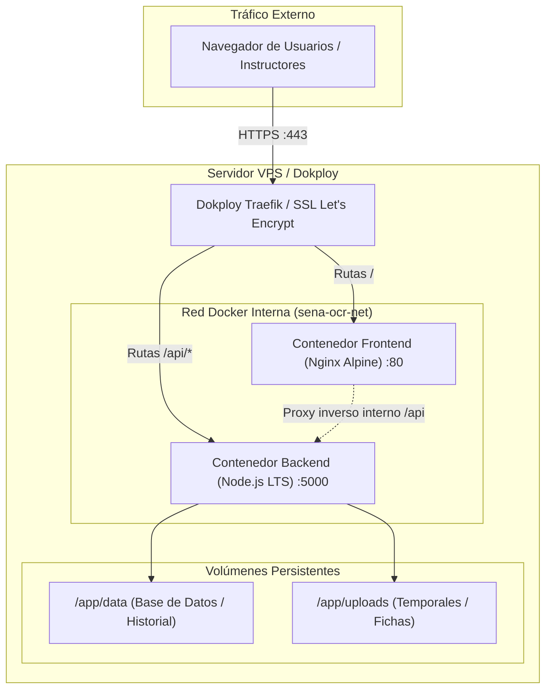

# 🚀 Módulo 10: Arquitectura de Despliegue en VPS y Dokploy

## 1. Descripción General
El **Módulo de Arquitectura y Despliegue** describe la infraestructura en producción, la contenedorización mediante **Docker**, la orquestación con **Docker Compose** y la automatización del despliegue en un servidor virtual privado (**VPS**) mediante la plataforma **Dokploy**.

Permite que el sistema se ejecute de manera reproducible, aislada y altamente escalable en cualquier proveedor de infraestructura en la nube (DigitalOcean, AWS, Hetzner, Oracle Cloud, Linode o servidores propios del SENA).

---

## 2. Archivos y Artefactos de Despliegue
- **Orquestación Global**: [`docker-compose.yml`](file:///c:/Users/Lenovo/Documents/SENA/OCR/docker-compose.yml)
- **Contenedor Backend**: `backend/Dockerfile` (Node.js 20 LTS Alpine/Slim con dependencias de C++ para Sharp y modelos ONNX)
- **Contenedor Frontend**: `frontend/Dockerfile` (Multi-stage build con Node.js para compilación y Nginx Alpine para servir estáticos)
- **Configuración de Nginx**: `frontend/nginx.conf` (Reverse Proxy para API `/api` y soporte SPA `try_files $uri /index.html`)
- **Variables de Producción**: `.env.production.example`
- **Guía Paso a Paso**: [`DOKPLOY_DEPLOYMENT_GUIDE.md`](file:///c:/Users/Lenovo/Documents/SENA/OCR/DOKPLOY_DEPLOYMENT_GUIDE.md)

---

## 3. Topología de Red y Arquitectura de Contenedores

---

## 4. Estrategia de Contenedores Multi-Stage

### Frontend (`frontend/Dockerfile`):
1. **Etapa de Construcción (Builder)**: Utiliza `node:20-alpine`, instala dependencias con `npm ci` y ejecuta `npm run build` produciendo el bundle estático en `/app/dist`.
2. **Etapa de Producción (Runner)**: Utiliza `nginx:alpine` ligero (~25 MB), copia los estáticos y aplica `nginx.conf` con compresión Gzip activada y encabezados de seguridad HTTP (HSTS, X-Frame-Options, Content-Type-Options).

### Backend (`backend/Dockerfile`):
1. Utiliza `node:20-bookworm-slim` para contar con librerías nativas compatibles con `sharp`, `onnxruntime-node` y `tesseract.js`.
2. Ejecuta bajo un usuario sin privilegios `node` para máxima seguridad ante vulnerabilidades.

---

## 5. Despliegue Automatizado en Dokploy
1. Conectar el repositorio de GitHub: `https://github.com/DF-VeraP/ocr`.
2. Seleccionar tipo de despliegue: **Docker Compose**.
3. Configurar variables de entorno requeridas en el panel de Dokploy:
   - `JWT_SECRET`
   - `ADMIN_EMAIL`
   - `SMTP_HOST`, `SMTP_PORT`, `SMTP_USER`, `SMTP_PASS`
4. Asignar dominio o subdominio y habilitar certificado SSL automático (Let's Encrypt).
5. Dokploy se encarga del *Zero-Downtime Deployment* ante cada push a la rama `main`.
